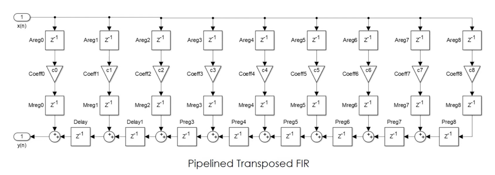
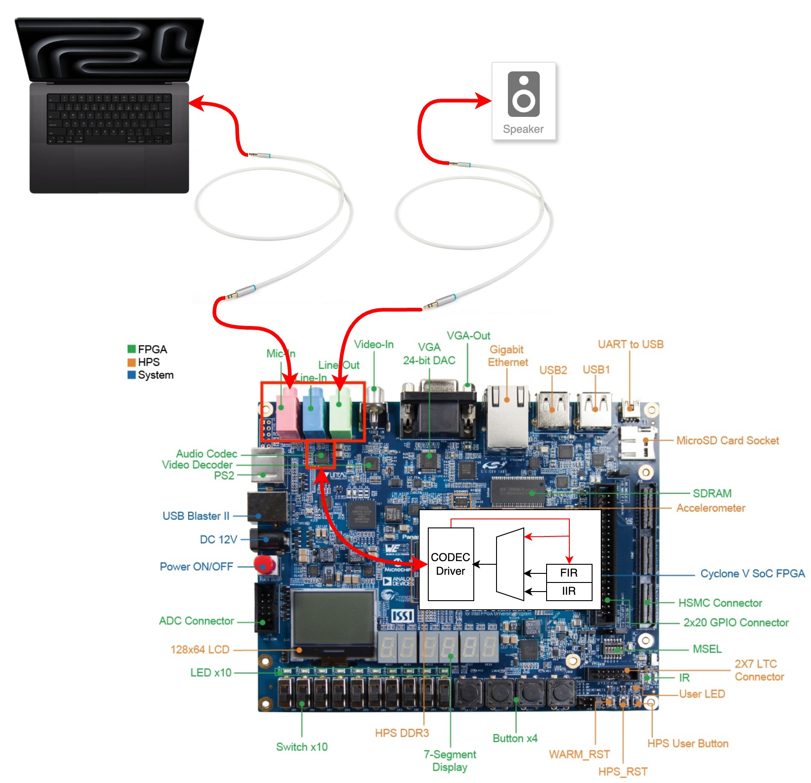

# Lab 2 - FIR and IIR Filter

## Objective

The objective of this lab is to design, implement, and test a finite impulse response (FIR) and a infinite impulse response (IIR) filters using FPGA technology. The goal is to understand the theory behind FIR and IIR filters, apply digital filter design techniques, and gain practical experience in hardware design and implementation. By completing this lab, students will develop skills in FPGA programming and digital signal processing (DSP).

## A Note about Collaboration

The lab is to be accomplished in groups. All work must be from your own team members.

Hints from others can be of great help, both to the hinter and the hintee.  
Thus, discussions and hints about the assignment are encouraged. However, the project must be coded and written up in groups (you may not show, nor view, any source code from other students’ groups). We **WILL** use automated tools to detect copying.

Use Emails/LMS to ask questions or come visit us (203B3) during office hours.  
We want to see you succeed, but you have to ask for help.

## Overview

In this lab, students will design an FIR and IIR filters using Verilog or SystemVerilog. The focus will be on understanding the filter design process, coding the filter architecture, and running simulations to verify the functionality of the FIR and IIR filters. Students are required to simulate the design to confirm its correctness.

For those seeking additional credit, there is an option to synthesize the design onto an FPGA and perform real-time testing. This will allow students to demonstrate their filter implementation on hardware, further reinforcing their understanding of FPGA-based digital signal processing (DSP).

The lab will include the following steps:

- Understanding the theory behind FIR and IIR filter designs.
- Understanding the difference (pros and cons) between FIR and IIR filters.
- Implementing the FIR and IIR filter architectures using Verilog and SystemVerilog.
- Running simulations to verify the functionality of the filters.
- Synthesizing the design on an FPGA, evaluate the synthesis result.
- Conducting real-time testing, demonstration.

## Background

### FIR Filter

Finite Impulse Response (FIR) filters are an essential component in digital signal processing (DSP) systems, widely used for tasks such as noise reduction, signal smoothing, and frequency selection. FIR filters are known for their stability and linear phase properties, making them suitable for various applications that require precise signal manipulation.

In digital systems, FIR filters are typically implemented using discrete-time convolutions of the input signal with a set of filter coefficients. These coefficients determine the filter's frequency response, and they can be designed to pass, reject, or attenuate specific frequency bands. The number of coefficients, or "taps," directly impacts the filter's performance, with more taps generally leading to more accurate filtering but also increased computational complexity.

Below is an 8th-order direct form FIR filter. Generally, increasing the filter order (taps) improves the filter's performance by providing better signal filtering and more precise frequency response. However, when implementing such a design in hardware, the issue of timing becomes critical. Since each tap is implemented as a combinational element, the longer the chain, the more difficult it becomes to meet timing constraints, resulting in a lower maximum operating frequency.

To address this, pipelining techniques can be applied. By introducing pipeline stages between the taps, the combinational delay is reduced, allowing for higher clock frequencies and improved overall performance in the hardware implementation.

The above schematic is just an example of a pipelined FIR filter. You are not required to follow this design exactly and are encouraged to propose your own design approach. Feel free to explore different architectures or optimizations that suit your specific implementation and performance goals.

### IIR Filter

An Infinite Impulse Response (IIR) filter is a digital filter that relies on both past input and output values to produce a current output. Unlike FIR filters, which use only input values and a finite number of coefficients, IIR filters use feedback mechanisms to achieve a recursive behavior. This makes IIR filters highly efficient for certain tasks, as they can meet frequency response requirements with fewer coefficients than an FIR filter.

However, designing IIR filters comes with challenges, such as ensuring stability, especially when implemented in hardware. Special care must be taken to avoid numerical instability, as small errors or delays in feedback can cause the filter to oscillate or behave unpredictably.

Below is a general block diagram of an IIR filter structure:

IIR filters are used for tasks such as smoothing, noise reduction, and frequency band selection, often in applications where real-time signal processing is required. Their recursive nature allows them to efficiently implement low-pass, high-pass, band-pass, or band-stop filters.

## Assignment Overview

In this lab assignment, you will design and simulate FIR and IIR filters using Verilog or SystemVerilog. Your task is to implement the FIR and IIR filters based on your specifications and verify its functionality through simulation. You are required to build your own testbench and obtain an audio sample to thoroughly test your design.

Your primary goal is to complete the FIR and IIR filter designs and verify their operation through simulation using the testbench and input signals. You also need to synthesize the design and demo it on an FPGA for real-time testing.

## FPGA Demonstration

To achieve a high grade, you must implement your design on the FPGA using the DE10 Standard Development Kit. Your demonstration should include two samples: a periodic wave and an audio wave. Ensure both demonstrations are well-prepared and clearly showcase the functionality and performance of your design.

1. **Periodic Wave Demonstration**  
   - Use the module you designed in Lab 1 to generate a periodic wave with added noise. This noisy signal will serve as the input for your filters.  
   - Apply your filters to remove the noise from the signal.  
   - Display both the input (noisy) and output (filtered) waveforms on an oscilloscope. Use the audio CODEC and a 3.5mm to BNC cable to connect the FPGA to the oscilloscope.  

   

1. **Audio Wave Demonstration**  
   - Use an audio input from your laptop or microphone connected to the FPGA's line-in/mic input.  
   - Process the noisy audio signal through your filters to produce a clean, filtered output.  
   - Play the filtered audio through a speaker to demonstrate the effectiveness of your filters.  
   - Choose an audio sample that clearly highlights the difference between the noisy and filtered versions. 

    

## For Credit

- **1 point**: Demonstrates a basic understanding of FIR filters and designs the specifications for the FIR filter.
- **1 point**: Completes the RTL design for the FIR filter, ensuring it aligns with the given specifications. These points are awarded only if you successfully simulate and verify the filter's functionality with at least one sample.
- **1 point**: Successfully simulates the FIR filter design with the provided input samples. Your analysis should explain how well the filter performs, identifying any issues in filtering and frequency response.
- **2 points**: Implements a pipelined/parallelized architecture to achieve higher operating frequency.
- **2 points**: Synthesizes the design, you should check the report to make sure the design is synthesizable.
- **3 points**: Performs a live demo on an FPGA, demonstrating real-time performance and signal processing.
- Bonus points:
	- Fully parameterizable FIR and/or IIR filter 
	- Demonstrates the filters's performance using real-world signals (audio signal)
	- Adaptive FIR and/or IIR filters with dynamically updated coefficients based on signal input
	- Propose your own idea for the improvements
	- If your filter results are not optimal, you should analyze and explain why the result is insufficient, and propose a solution to improve it. Even if the filter performance is not ideal, a well-explained analysis can still earn bonus points.

## Reporting Requirements

Your report should be concise but detailed enough to clearly explain your design process, simulations, and results. Make sure to:
- Include explanations of the design choices you made, particularly if you implemented a pipelined architecture or any optimizations.
- Show clear evidence of how your FIR and IIR filters perform with the provided input signals, including graphs or waveforms and analysis.
- If the filter doesn’t perform well, offer a detailed analysis of why the results are not as expected and propose improvements or solutions.
  
Your report should focus on quality rather than length. While it shouldn’t be excessively long, it needs to be thorough and well-structured. Points will be deducted for poor reporting, such as missing key details, insufficient analysis, or unclear presentation. Make sure to present your work in a professional and readable format.

## Frequently asked questions

1. **How can we do the demonstration on FPGA?**  
   The guide has been updated for FPGA demonstration. You can follow the instructions in the updated guide for setting up your demo on the DE10 kit.

2. **If multiplication is used, do I need to write out the multiplier, or can I just use the multiplication operator?**  
   You can use the multiplication operator.

3. **In my code, I use a for loop for calculations. Is that acceptable?**  
   You can code in any way that works to get the simulation result. However, if you plan to synthesize the design onto the FPGA, the code must be synthesizable.

4. **Is FPGA limited to a maximum of 33 taps?**  
   When simulating, you can use as many taps as you like. When synthesizing and loading onto the FPGA kit, you need to be mindful of the resources on the DE10 and adjust the number of taps accordingly.

## How To Turn In Your Solution

This semester we will be using LMS, simply submit the zip file with your reports and codes.

## Demos and Late Penalty

We will have demo / presentation times on of class times on or near the due date. Since we will demo from the files in your zip, it is possible that you’ll demo on a following day.

**Define Late:** Lateness is determined by the file dates of your submission on LMS.
